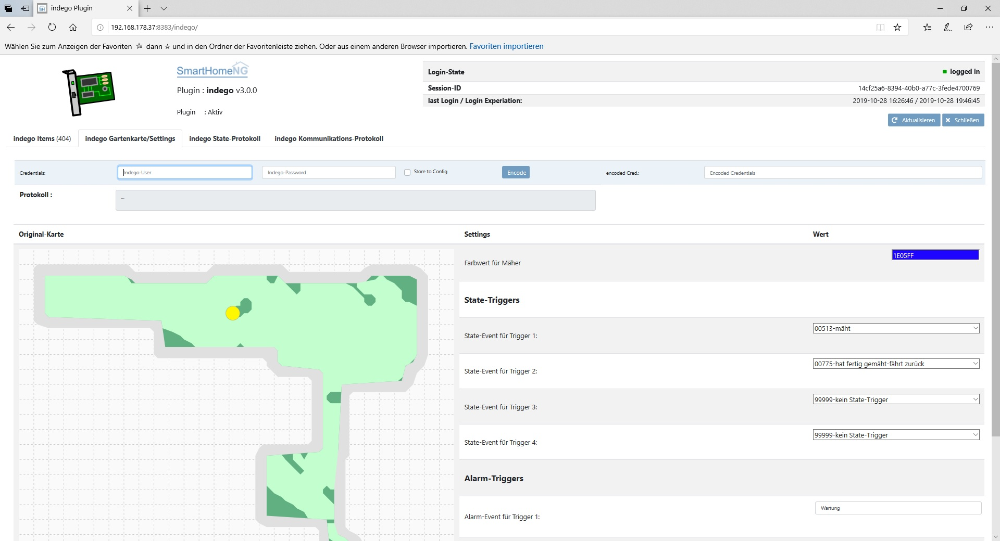

# Indego

## Table of Content

1. [Generell](#generell)
2. [Credits](#credits)
3. [Change Log](#changelog)<sup><span style="color:red"> **Neu**</sup></span>
4. [Konfiguration](#konfiguration)<sup><span style="color:blue"> **Update**</sup></span>
5. [Web-Interface](#webinterface)<sup><span style="color:blue"> **Update**</sup></span>


## Generell<a name="generell"/></a>

Das Indego-Plugin wurde durch ein Reverse-Engineering der aktuellen (Version 3.0) App
von Bosch entwickelt. Als Basis diente das ursprüngliche Plugin von Marcov. Es werden alle Funktionen der App sowie einige zusätzliche bereitgestellt.
Das Plugin erhält die Version der aktuellen Bosch-API.

## Credits<a name="credits"/></a>

Vielen Dank an schuma für die tolle Unterstützung während der Entwicklungsphase,
die Umsetzung vieler Teile in der Visu sowie den vielen unzähligen Tests und sehr viel Geduld.

Vielen Dank an psilo für die Erlaubnis zur Verwendung der LED-Grafiken im Web-Interface.
Vielen Dank an bmx für das Umstellen des Plugins auf Smart-Plugin.
Vielen Dank an Marcov für die Entwicklung des ursprünglichen Plugins.
Vielen Dank an das Core-Team für die Einführung der STRUCTS, das hat die Arbeit deutlich vereinfacht.
Vielen Dank an Jan Odvarko für die Entwicklung des [Color-Pickers](#http://jscolor.com) unter Freigabe für Opensource mit GPLv3   

## Change Log<a name="changelog"/></a>

#### 2019-10-28 V3.0.0
- Kommunikation auf requests geändert
- Verwendung von vordefinierten STRUCTS für alle benötigten Items
- verbessertes Login/Session-Handling
- Umstellung auf Code64 verschlüsselte Credentials
- Integration eines Wintermodus wenn der Mäher stillgelegt ist
- Integration der Mähkalenderverwaltung
- Integration der SmartMow-Einstellungen
- Integration "Mähen nach UZSZ"
- verbesserte Darstellung der Icons für das Wetter
- Gartenkarte als Item in Visu integriert
- "pimpen" der Gartenkarte mit eigenen Vektoren
- Mähspurdarstellung für die IndegoConnect 350/400
- Aktualisierung der Mäherposition beim Mähen alle 7 Sekunden
- Darstellung der Informationen zum genutzten GSM-Netz sowie zum verwendeten Standort
- Updatefunktionen für Firmware integriert
- Integration der Sensorempfindlichkeit
- Integration von unterschiedlichen Bilder für Große/Kleine Mäher
- Alarme / Meldungen werden in einem Popup dargestellt und können gelesen/gelöscht werden.
- VISU um Batterie-Informationen erweitert
- diverse Charts für Batterie, Temperatur, Mäheffizienz, Mäh-/Ladezeiten
- Protokoll für Mäher STATI und Bosch-Kommunikation im Web-Interface
- Unterstützung für base64 codierte Credentials im Web-Interface
- Trigger für Alarme und STATI des Mähers im Web-Interface
- Mäherfarbe für die Darstellung der Kartenkarte im Web-Interface wählbar
 


## Requirements

Das Plugin benötigt keine zusätzlichen requirements

### benötigte Software

* SmartVISU 2.9
* smarthomeNg 1.6 oder höher (es werden vordefinierte STRUCTS verwendet)


### Supported Hardware

* all that supports smartHomeNG


## Konfiguration<a name="konfiguration"/></a>

### plugin.yaml

folgende Einträge werden in der "./etc/plugin.yaml" benötigt.

* `class_name`:  fix "Indego"
* `class_path`:  fix "plugins.indego"
* `path_2_weather_pics`: ist der Pfad zu den Bilder des Wetter-Widgets.
(default ="/smartVISU/lib/weather/pics/")
* `img_pfad`:  ist der Pfad unter dem die Gartenkarte gespeichert wird. 
(default = "/tmp/garden.svg")
Die Datei wird nicht für die VISU benötigt. Man kann die Datei als Vorlage
zum "pimpen" der Gartenkarte verwenden
* `indego_credentials`:  sind die Zugangsdaten für den Bosch-Server im Format base64 encoded.
* `parent_item`:  name des übergeordneten items für alle Child-Items
* `cycle`:  Intervall in Sekunden für das Abrufen des Mäher-Status

Die Zugangsdaten können nach dem Start des Plugins im Web-Interface erfasst und gespeichert werden 


```yaml
indego:
    class_name: Indego
    class_path: plugins.indego
    #path_2_weather_pics: /smartVISU/lib/weather/pics/
    #img_pfad: /tmp/garden.svg
    indego_credentials:
    parent_item: indego 
    cycle: '30'
    url: https://api.indego.iot.bosch-si.com/api/v1/
```


### items.yaml

Es wird ledigliche folgender Eintrag für die Items benötigt.
Die restlichen Informationen werden aus der mitgelieferten Struct-Definition gelesen.
Eine entsprechende Config-Datei ist im Ordner "items" des Plugins bereits vorhanden und
muss nur in den Ordner "./smarthome/items" kopiert werden.

```yaml
%YAML 1.1
---

indego:
    struct: indego.child
```

### SmartVisu

Die Inhalte des Ordners "./dropins" müssen in den entsprechenden Ordner der VISU.
In der Regel "/var/www/html/smartVISU2.9/dropins" kopiert werden.

Im Ordner "/pages" des plugins ist eine vorgefertigte Raumseite für die SmartVISU.
Diese muss in den Ordner "/pages/DeinName/" kopiert werden und die Raumnavigation entsprechend ergänzt werden.

<strong>!!! Immer auf die Rechte achten !!!</strong> 

## Web-Interface<a name="webinterface"/></a>

### erster Tab - Übersicht Indego-Items


### zweiter Tab - Originalgartenkarte / Settings
Hier wird die Original-Gartenkarte wie sie von Bosch übertragen wird angezeigt.
Es kann mit dem Colour-Picker die Farbe des Mähers in der Visu angepasst werden.
Die Originalkarte bleibt unverändert. Im ersten Tab wird unter dem Item indego.visu.map_2_show
die modifizierte Karte angzeigt
Es können hier bis zu 4 Trigger für Stati gewählt werden. 999999 - kein Status gewählt.
Immer wenn der Status des Mähers auf den gewählten Status wechselt wird das Trigger-item
"indego.trigger.state_trigger_<strong>X</strong>:" (X = 1-4 ) gesetzt. Die Trigger können in einer Logik
verarbeitet werden. Beispiel siehe bei Logiken.
Es können bis zu 4 Texte für Meldungen erfasst werden. Wenn der Text in der Überschrift oder im Inhalt der
Meldung ist wird der Trigger "indego.trigger.alarm_trigger_<strong>X</strong>:" (X = 1-4 ) beim eintreffen der Meldung gesetzt. 




### dritter Tab - State-Protokoll
Hier können die einzelnen Statuswechsel des Mähers eingesehen werden.
Es erfolgt bei jedem Statuswechsel ein Eintrag, das Protokoll ist selbst rotierend und hat 
maximal 500 Einträge


### vierter Tab - Kommunikationsprotokoll
Hier können Protokoll-Einträge zu den einzelnen Kommunikationsanfragen mit dem Bosch-Server eingesehen werden.
Es erfolgt bei jedem Statuswechsel ein Eintrag, das Protokoll ist selbst rotierend und hat 
maximal 500 Einträge

